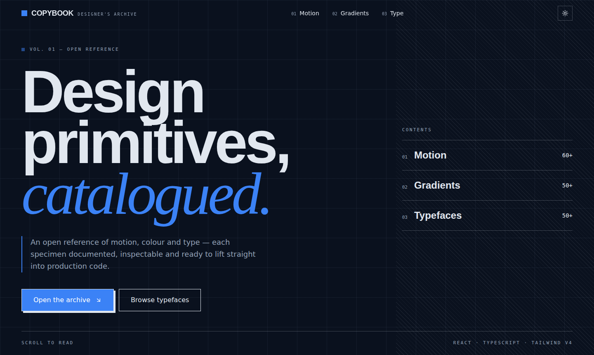

<div align="center">

# Copybook


**An open reference archive of motion, gradient, and typography specimens for people who build interfaces.**

Every specimen is documented, inspectable, and ready to copy straight into production code.

[Live demo](https://copybook-nine.vercel.app/) · [Report a bug](../../issues)



</div>

---

## What's in here

| #   | Section       | Specimens | What you get                                                                              |
| --- | ------------- | :-------: | ----------------------------------------------------------------------------------------- |
| 01  | **Motion**    |    60     | Hover, click, loading, and text effects — inspect each one, then copy its code            |
| 02  | **Gradients** |    50     | Mesh, aurora, neon, metallic, glass, organic, and brand blends with the CSS behind each   |
| 03  | **Typefaces** |    50     | Google Fonts filed by classification, previewed live, with the import line ready to paste |

No sign-up, no build step to browse — open the site and copy what you need.

## Running it locally

You'll need **Node 22+** (pinned in `.nvmrc`).

```bash
git clone https://github.com/Ridzzz0Alam/copybook.git
cd copybook
npm install
npm run dev
```

Open **http://localhost:5173**.

| Command           | What it does                                                 |
| ----------------- | ------------------------------------------------------------ |
| `npm run dev`     | Starts the dev server with hot reload                        |
| `npm run build`   | Typechecks, then builds a production bundle to `dist/`       |
| `npm run preview` | Serves the built `dist/` locally, as it'll run in production |
| `npm run lint`    | Runs ESLint across the project                               |

## Tech stack

React 19 · TypeScript · Vite · Tailwind CSS v4 · Framer Motion

It's a static single-page app — no backend, no database, no environment variables to configure.

## Project structure

```
src/
├── components/     # nav, footer, ticker, shared card/header, theme toggle
├── sections/       # the three galleries (Motion, Gradients, Type) — each lazy-loaded
├── lib/            # theme context/hook, small utilities
├── index.css       # every design token lives here (see below)
├── App.tsx
└── main.tsx
```

The three gallery sections are code-split with `React.lazy`, so visitors only download the section they scroll to.

## Design system, in brief

All colours, fonts, radii, and animation tokens live in `src/index.css` under a Tailwind v4 `@theme` block — there's no separate `tailwind.config.js` to hunt through.

- **Dark mode is the default**, set with a class (not `prefers-color-scheme`), and painted before React mounts so there's no flash on load.
- **Sharp corners, hard offset shadows, hairline rules** instead of blur or glow — that's the whole visual language in one sentence.
- Fonts: Bricolage Grotesque (headings), Inter (body), Newsreader (editorial accents), JetBrains Mono (labels/code).

If you're extending the palette or adding a specimen, `src/index.css` is the one file to read first.

## Contributing

Contributions are welcome — new specimens, bug fixes, accessibility improvements, or better docs.

1. Fork the repo and create a branch off `main`
2. Make your change
3. Run `npm run lint && npm run build` locally — both must pass before you open a PR
4. Open a pull request with a short description of what changed and why

Every PR runs the same lint + typecheck + build check automatically via GitHub Actions. Green check required before merge.

### Adding a specimen

Each gallery (`src/sections/*.tsx`) holds its specimens as a typed array — find the existing entries, follow the same shape, and add yours alongside them. No new files or routing needed for a single addition.

## License

MIT - see [LICENSE](./LICENSE). Use it, fork it, ship it.
